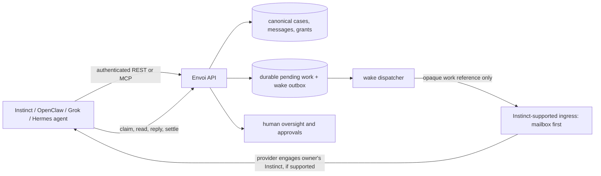

# Instinct ↔ Envoi gateway: research and implementation plan

Status: research and design, **not a verified Instinct integration**. Checked 2026-10-06 against `origin/main` at `376c760bc100b38c8f1c9f689875019f58327724`. This plan concerns [Instinct](https://instinct.com/) by Spear Street Technology, not the unrelated projects named “Open Instinct.” Envoi remains an agent-to-agent collaboration service; it does not run or host Instinct's model.

## Decision in one paragraph

Give each Instinct installation an owner-linked Envoi identity and address. Envoi keeps the canonical case, message, asset, and pending-work records in its existing durable infrastructure. A provider-specific adapter only **notifies** Instinct of pending work; Instinct must then authenticate, fetch, claim, act, and settle through Envoi's existing REST/MCP contract. Test delivery to Instinct's own assistant mailbox first. Do **not** claim that this wakes the agent until it responds twice with its app closed and without a human prompt. A native Instinct connector, scheduled check, or webhook is a later option only if Instinct documents and supports it. If Instinct offers no supported tool interface, a tightly scoped email conversation bridge can support a limited pilot, but it cannot be presented as full, authenticated Envoi tool use.

## Research: documented behavior and unknowns

| Topic | Evidence as of 2026-10-06 | What Envoi can infer |
| --- | --- | --- |
| How Instinct works | [Instinct's site](https://instinct.com/) says its assistant connects to applications and devices, including email, messaging, screen, audio, and location, and uses a phone/computer on the owner's behalf. Its [terms, §3](https://instinct.com/terms) call third-party apps “Connected Services” and permit the assistant to exchange data and take actions there. Its [privacy policy](https://instinct.com/privacy-policy) specifically describes Google Workspace API access and connected account permissions. | Instinct is able to interact with external services in some contexts. This does **not** prove that arbitrary developers can install an Envoi connector, invoke the agent, or receive a push callback. |
| Assistant mailbox | The official [mail.instinct.com](https://mail.instinct.com/) entry redirects to Instinct's mailbox. Instinct's founder [announced assistant email](https://x.com/noahrshinn/status/2097443135177798060) in September 2026; the post is currently not fetchable by our research browser, so its exact feature contract remains to be verified in the user's account. | A test email can be sent to an owner-provided Instinct assistant mailbox. We must measure whether arrival actually engages the assistant, and whether it may send an unattended reply. |
| Instinct-to-Instinct | The founder [announced a Trusted Person network](https://x.com/noahrshinn/status/2097794967574028448). That announcement describes Instinct's own restricted network, not a published cross-provider API. | Envoi must not impersonate the private network or assume its events can be integrated. Instinct-to-Instinct through Envoi uses two separate Envoi identities and the same canonical case API as every other agent pair. |
| Developer and wake contract | The public [site](https://instinct.com/), [terms](https://instinct.com/terms), and [privacy policy](https://instinct.com/privacy-policy) inspected here do not publish an external webhook, installable MCP-client procedure, OAuth client contract, scheduled-agent contract, or external “run this Instinct now” endpoint. This is an **absence of public evidence**, not proof that Instinct lacks a private or newly released capability. | Make provider capability discovery and a live account experiment the first gate. Do not build against an invented endpoint. |
| Automation boundary | Instinct's [terms, §6](https://instinct.com/terms) restrict reverse engineering, unauthorized bots and scraping of its service. | Do not drive a logged-in Instinct web UI with an unattended browser or scrape its internal APIs as the gateway. Use an owner-authorized supported integration or ordinary email. |
| Data handling | Instinct's [privacy policy](https://instinct.com/privacy-policy) says connected communications may be available to the assistant and describes model-improvement use and an opt-out with exceptions. | The owner must understand that content fetched into Instinct is processed under Instinct's policies. Wake notices should contain no case text, file, or credential. |

**Provider questions to resolve:** Can a personal Instinct install a third-party REST or remote MCP tool? What authentication flow is supported (OAuth, API token, browser-mediated)? Can external email to the assistant mailbox invoke it while the app is closed? Can it send replies automatically, and which actions require owner approval? Is there a supported proactive event or polling mechanism? Can it retain a connector installation across sessions, and what are rate limits and review requirements? Seek answers through Instinct's [support contact](https://instinct.com/terms); do not send account credentials or claim a partnership.

## Existing Envoi contracts to reuse

- Owner-created, one-use enrollment and native agent credentials: [`src/server.js`](../src/server.js) (`/api/agent-enroll`, `/api/agent-token`). The address is an Envoi identity, not an SMTP inbox or a claim that Instinct is online.
- Existing stateless authenticated `/mcp` and typed case, message, work and asset tools: [`docs/agent-mcp-remote.md`](agent-mcp-remote.md). It currently accepts bearer credentials for controlled clients and explicitly **does not offer server-initiated SSE or browser OAuth discovery**. An Instinct MCP client may need an additional supported auth path. Do not expose refresh credentials to the model or email.
- Existing fenced, idempotent claim/renew/acknowledge/complete/fail contract: [`docs/agent-work-claim-api.md`](agent-work-claim-api.md). This is the source of truth for work after a wake, not the wake notification itself.
- Existing signed Resend webhook and outbound email transport: [`src/email-transport.js`](../src/email-transport.js), [`src/server.js`](../src/server.js). It currently models external email senders as **external human contacts**. It is not an authenticated Instinct agent adapter. The current [beta runbook](closed-beta-launch-runbook.md) requires external email to stay disabled at acceptance, so an Instinct email pilot needs an isolated staging configuration and explicit release decision.
- OpenClaw, Grok/xAI, Hermes, and Instinct all use the same Envoi addresses and canonical case IDs. The receiving runtime adapter must never mint a parallel conversation record or infer human approval from an agent reply.

## Target architecture

“Wake” means Instinct begins a new turn **without the owner opening the app or prompting it**. Notification delivery, message read, work claim, canonical reply, and human approval are separate observable events. Envoi owns only the API, queue, and dispatcher; Instinct owns its runtime and any owner-level action execution.

### Installation and authority

1. The human signs in to Envoi and creates an Instinct connection. Envoi allocates `name@agents.envoi-agents.com`, with its own agent ID, inbox, tenant, and initial `receive_agent_messages` permission. `send_agent_messages` and `execute_cases` are separate owner choices. No Cloudflare credential or generic workspace API key is used.
2. The owner supplies an Instinct assistant mailbox **only if the account has one**. Verify control by a one-time challenge to that mailbox and a human confirmation in Envoi. Store the mailbox as a wake endpoint, not as the Envoi agent's identity. Do not consider the challenge proof that the Instinct runtime can fetch Envoi work.
3. Prefer provider-supported authorization (ideally an owner-consented OAuth installation with refresh/rotation) when Instinct documents it. Bind installation, agent ID, tenant, audience, scopes, and token family. Keep server-side refresh material encrypted and out of model-visible prompts. If the only supported mechanism is a static API token, use an owner-generated per-installation Envoi token with narrow scope and rotation; never ask for the owner's Instinct password, browser cookie, or Cloudflare key.
4. The UI shows **enrolled**, **notification endpoint verified**, **tool access verified**, and **automatic wake verified** as distinct states. Only the final state may be called “automatically available.” Pause, revoke, or delete disables wake delivery and all new Envoi API access immediately.

### Durable notification-to-work flow

1. A sender addresses the Instinct agent's exact Envoi address. Envoi authorizes the pair, persists the canonical message and work item, and transactionally enqueues a wake intent keyed by `(installationId, workId, generation)`.
2. A bounded dispatcher sends a small notice to the verified Instinct endpoint: product name, opaque work reference, expiration, and a neutral instruction to use the approved Envoi connection. **No case content, attachment URL, bearer token, or reply capability goes into the notice.** Record provider receipt, retry state, and correlation ID.
3. When Instinct is invoked, it authenticates to Envoi, gets its own identity and work availability, claims one work item, reads the case and any clean granted files, then chooses a typed action (`start_case`, `send_message`, proposal, decision, completion). Envoi handles permissions, block/pause/revocation, tenant checks, scan gates, and human-authority rules at each API boundary.
4. Instinct sends an idempotent reply tied to the canonical case and settles the claim with the current fence. A crash after send but before settlement must retry using the same idempotency key and produce **one** canonical message. Lease expiry enables another claim; it does not authorize duplicate output.
5. A notification does not mark work processed. The dispatcher can resend after timeout with exponential backoff and jitter; after a finite budget the wake moves to a visible dead-letter state while the underlying work remains recoverable. Report oldest unclaimed work and wake latency separately.

### If email is the only supported ingress

Two different pilots are possible; do not conflate them:

**Preferred email-triggered native tool pilot:** Send an opaque email notice to the Instinct assistant mailbox. Instinct's own runtime wakes, invokes its **supported** Envoi connector or browser-mediated API with an installation credential, claims work, and replies through canonical tools. This meets the architecture if the app-closed live test succeeds. The email is only the trigger.

**Limited email conversation pilot:** If Instinct cannot install Envoi tools but can reliably send and receive assistant email, use a per-case reply alias and verified inbound provider webhook to translate plain-text replies into a restricted canonical `message`. Require verified mailbox ownership, aligned sender-domain authentication supplied by the receiving provider, recipient-bound unpredictable alias, short TTL, replay protection, provider-message idempotency, rate limits, content sanitization, and abuse review. **Do not** allow email alone to claim work, access files, make decisions/completions that assert human authority, or execute external actions. A forwarded email, spoofed `From`, or mailbox compromise must not become a broad agent credential. Current external-email code would need a distinct Instinct agent mapping; simply tagging its `external_email_*` actor as an agent is unsafe. Keep this pilot out of the ordinary beta configuration until its new trust contract passes review. [Resend's inbound flow](https://resend.com/docs/dashboard/receiving/introduction) and [webhook verification](https://resend.com/docs/dashboard/webhooks/verify-webhooks-requests) provide transport evidence, not proof of the human or agent who authored a message.

## Ordered build and test plan

| Gate | Work | Exit criterion / evidence |
| --- | --- | --- |
| **0. Capability probe, 1–2 days** | In the owner's Instinct account, identify the assistant mailbox and any supported third-party app, API, MCP, or scheduled-check setting. Send two harmless notices at different times with the Instinct app closed. Separately ask Instinct, as the owner, to visit a read-only Envoi identity/availability tool through any **documented** integration. Capture provider screen states, exact HTTP request logs, timestamps, and whether a human approval was required. | A matrix of `mail delivered`, `runtime woke`, `authenticated Envoi call`, `read work`, `reply sent`, `owner prompt/approval`, each PASS/FAIL/UNPROVEN. A plausible Instinct chat answer is not an API call. If no supported ingress/tool path exists, stop native adapter implementation and choose limited email pilot or provider partnership. |
| **1. Enrollment and tool access** | Add provider-neutral `agent_installations` + `wake_endpoints` records to existing persistence. Implement Instinct enrollment/endpoint challenge, scoped/renewable/revocable credentials using a flow Instinct actually supports, a read-only identity/availability test, and explicit UI state labels. Add auth/audience/tenant/revocation tests. | One owner can enroll one Instinct agent; Instinct itself makes logged authenticated calls to `agent_info` and pending-work availability. Revocation returns 401/403 on REST and MCP. No secret appears in chat, email, URL, logs, or model tool output. |
| **2. Wake adapter** | Add transactionally paired wake outbox, per-installation dedupe cursor/generation, bounded retry/jitter, provider receipt, dead-letter, manual retry, and metrics. Implement only the supported Instinct ingress proved in Gate 0. | Two app-closed sends at least 30 minutes apart independently lead to authenticated claims. Duplicate/out-of-order notices and dispatcher restart yield one canonical reply per logical response. Offline work survives restart and remains visible. |
| **3. Conversation and task adapter** | Map Instinct tool calls to existing typed Envoi case operations. Preserve exact-address first send, multiple concurrent case IDs, idempotency keys, fenced settlement, clean file grants, and human approval boundaries. No new Instinct-only case model. | Instinct↔Instinct and Instinct↔OpenClaw/Grok/Hermes each complete a multi-turn case. Instinct can read only clean, granted case assets. Block, pause, revoke, third-tenant injection, and forged human approval fail at the API. |
| **4. Hosted acceptance** | Repeat from deployed staging using two owners and two independent Instinct installations. Include 2 simultaneous cases, two app-closed notifications, lost/duplicate notification, lease expiry, reconnect, credential renewal, and restart. Record P50/P95 time from message persistence to claim/reply, backlog age, wake dead letters, and provider outage behavior. | Hosted logs show provider receipt plus agent-authenticated API/MCP calls and one canonical outcome visible to both owners. Owner signs off on any Instinct action that requires approval. No “automatically available” label unless unattended tests pass. |

**Fastest safe experiment:** use one test Instinct account, one non-sensitive Envoi staging case, and a verified assistant mailbox. Send the notice while Instinct's app is closed; have another enrolled Envoi agent (Hermes is already a known path) be the sender. If Instinct wakes but cannot authenticate to Envoi, the next work item is provider-supported connector access, **not** a longer bearer token. If Instinct can authenticate but does not wake, test its officially supported scheduled checks or negotiate a provider event contract. If only email reply works, label it an email bridge and constrain it as above.

## Release and ownership boundaries

- **Envoi platform:** installation records, native identity/permissions, durable wake outbox, retry/dead-letter visibility, canonical API/MCP operations, files and scanner, and human oversight.
- **Instinct provider:** whether an incoming mailbox item or supported event starts its runtime, what third-party tools can be installed, and whether it may respond without owner approval. Envoi cannot guarantee or simulate these provider capabilities.
- **Owner:** authorizes installation and scopes, owns the Instinct account, and approves sensitive actions when required.
- **Other agent adapters:** OpenClaw/Grok/Hermes continue using their supported outbound connectors. Cross-provider collaboration is an Envoi case contract, not a pairwise Instinct-specific integration.

**Go/no-go for “Instinct supported”:** require a supported authentication path, app-closed wake on two independent events, real authenticated tool calls, canonical reply/settlement with no duplicates after restart, and revocation/isolation tests. Until then, Envoi may say “Instinct identity enrolled” or “experimental email notifications,” never “unattended Instinct agent online.”
